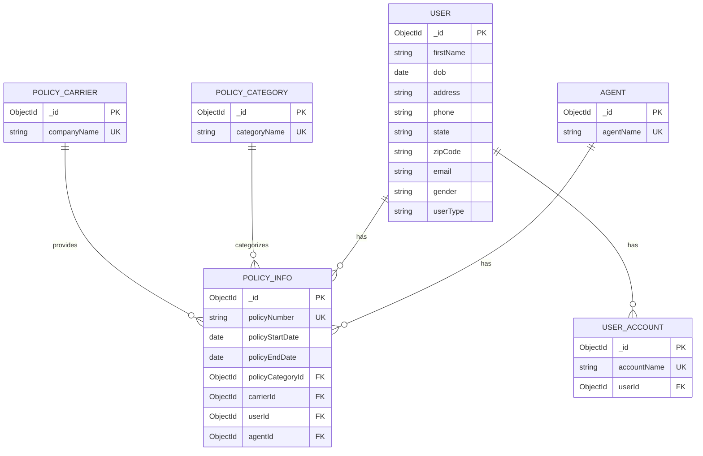

# Policy Management System

Node.js backend assignment for managing agents, users, accounts, policies, policy categories, and carriers using MongoDB.

## Tech Stack

* Node.js
* Express.js
* MongoDB
* Mongoose
* BullMQ + Redis
* Worker Threads
* Multer
* XLSX

## Features

* Upload XLSX/CSV policy data
* Process uploaded data using Worker Threads
* Store data in separate MongoDB collections
* Search policies using username/account name
* Aggregate policies by user
* Monitor Node.js CPU usage and restart at 70%
* Schedule messages using BullMQ + Redis

## Project Structure

```text
src/
├── config/
├── controllers/
├── db/
├── model/
├── routes/
├── workers/
└── server.js
```

## Environment Variables

Create a `.env` file:

```env
PORT=
DB_URI=
REDIS_HOST=
REDIS_PORT=
```

## Installation

```bash
git clone https://github.com/Ashutosh-pixel/policy_backend.git
cd policy_backend
npm install
```

## Run Redis

Make sure Redis is running:

```bash
redis-server
```

## Run API Server (pm2 responsible for server restart after cpu hits 70% usage)

```bash
pm2 restart backend
```

## Stop API Server

```bash
pm2 stop backend
```

## Run Message Worker (In separate terminal)

The BullMQ worker runs separately:

```bash
npm run worker 
```

## API Endpoints

### Upload Policy Data

```http
POST /api/upload/
```

Form-data:

```text
file: policies.xlsx
```

Supports XLSX/CSV files.

### Search Policies

```http
GET /api/upload
```

### Policies By Username

```http
GET /api/policy/search?username=
```

### Aggregate Policies By Users

```http
GET /api/policy/?page=&limit=
```

### Schedule Message

```http
POST /api/message
```

Request body:

```json
{
  "message": "Policy renewal reminder",
  "day": "2026-08-25",
  "time": "15:30"
}
```

The message is inserted into MongoDB at the scheduled time.

## Notes

* `UserAccount.accountName` is treated as the username.
* `PolicyInfo.userId` is used to find all policies belonging to a user.
* Redis stores scheduled BullMQ jobs, so scheduled jobs are not dependent on Node.js memory.
* The message worker must be running separately for scheduled jobs to be processed.




